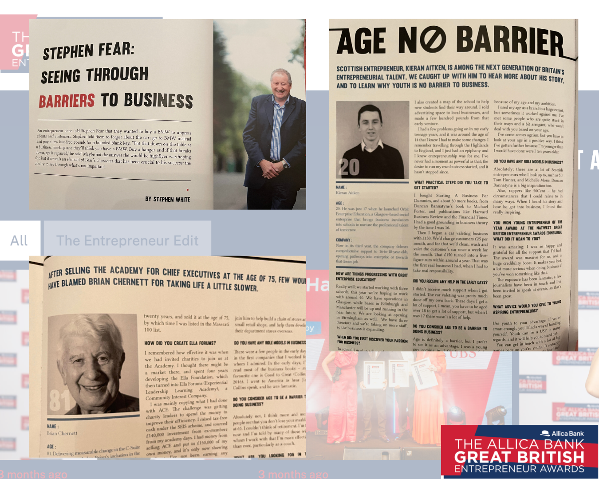
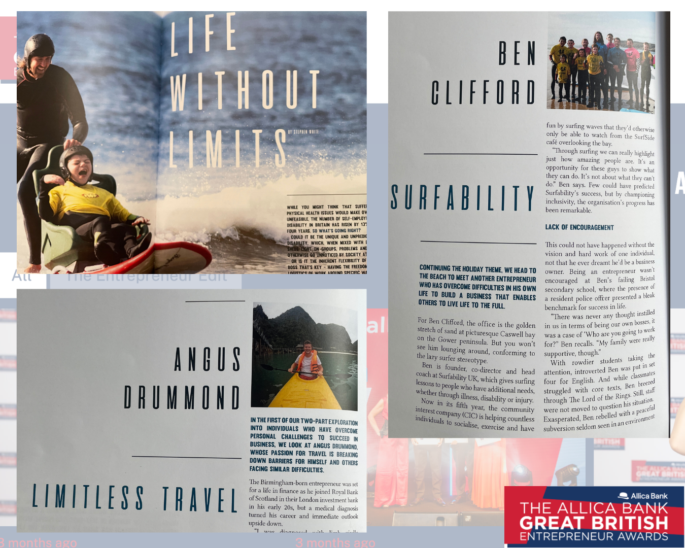
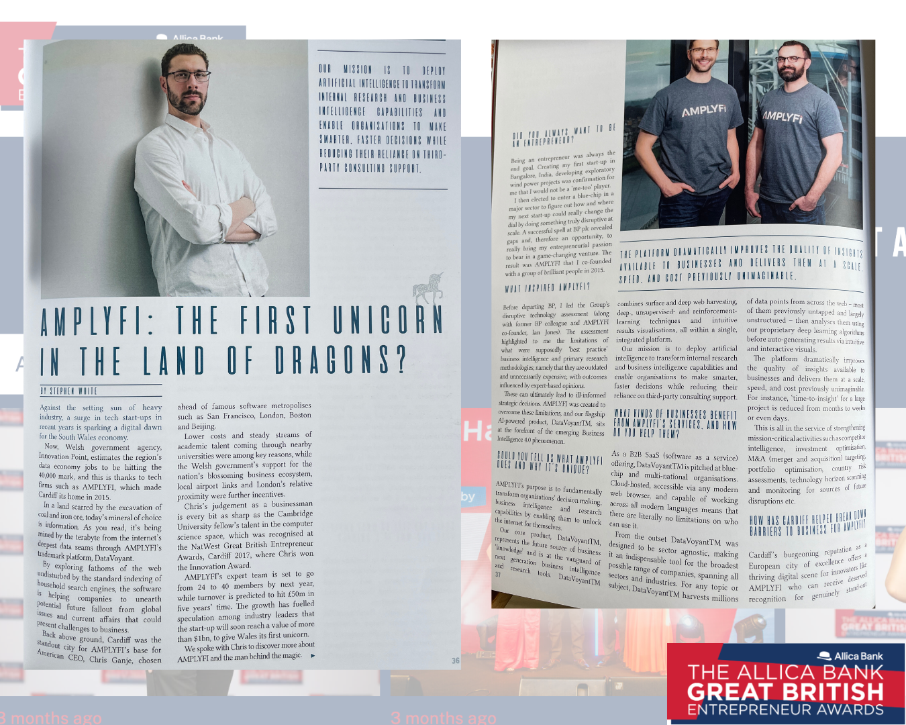
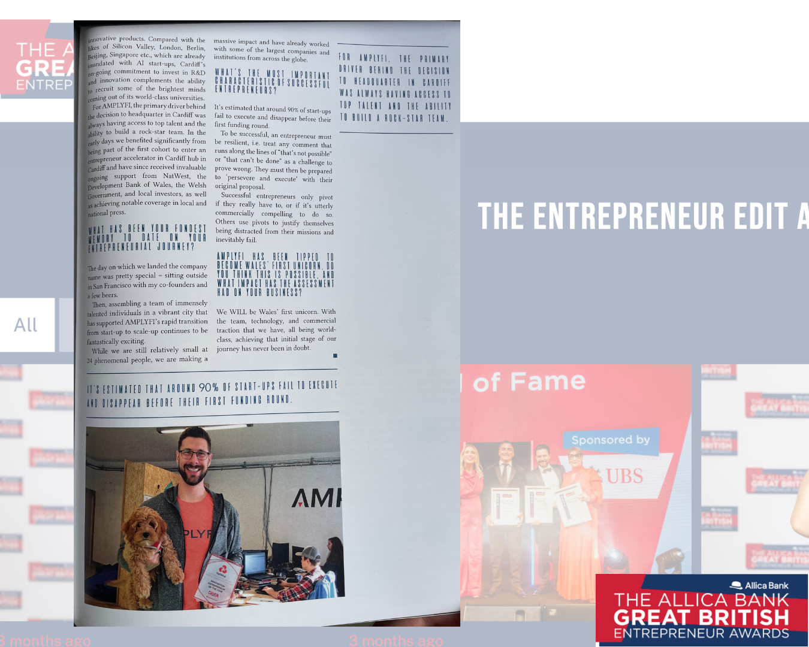
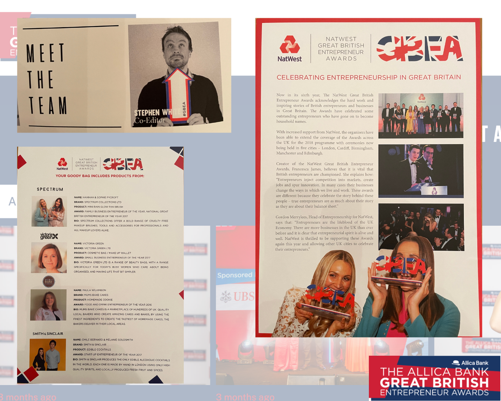

# Entrepreneurship Journalism
A portfolio of entrepreneurship journalism and editorial work produced for the Great British Entrepreneur Awards, including interviews, profiles and feature reporting on founders, SMEs, and business leaders across the UK.

During my time working with the Great British Entrepreneur Awards, I served as **co-writer and co-editor of *Entrepreneurs GB Magazine***.

The publication featured interviews, profiles and feature reporting on leading UK entrepreneurs, startup founders and emerging businesses.

## Entrepreneurs GB Magazine – Spring 2018

## Entrepreneur Profiles, Q&A

Profiles from *Entrepreneurs GB Magazine* exploring the experiences and perspectives of UK entrepreneurs and business leaders.

Profiles include entrepreneur and investor Stephen Fear, rising founder Kieran Aitken, and leadership expert Brian Chernett.

## Entrepreneur Features

A selection of features from *Entrepreneurs GB Magazine*, highlighting emerging companies, founder stories and the wider UK startup ecosystem.

This section highlights the story of entrepreneur Ben Clifford, and Birmingham-born Angus Drummond, both of whom have overcome considerable personal challenges to succeed in business.

## Tech Reporting

### Amplifi: The First Unicorn in the Land of Dragons?

A feature exploring the growth of Cardiff-based technology company AMPLIFI and the rise of the Welsh startup ecosystem.

## Short-Form Editorial and Copywriting

Examples of short-form editorial writing and caption copy produced for *Entrepreneurs GB Magazine*.

This work includes entrepreneur mini-profiles, product features and curated list content written to accompany editorial photography and award coverage.

