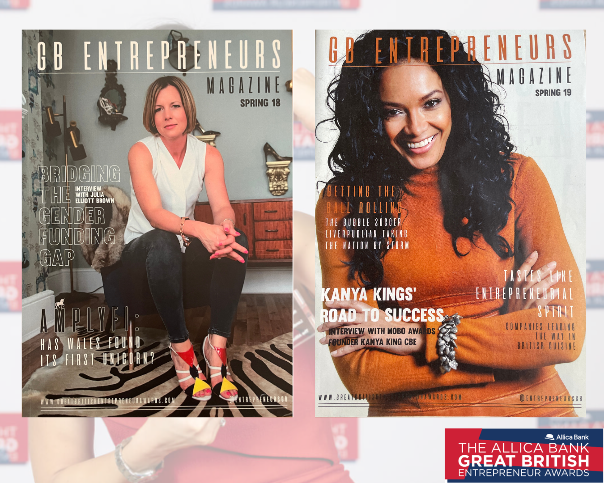
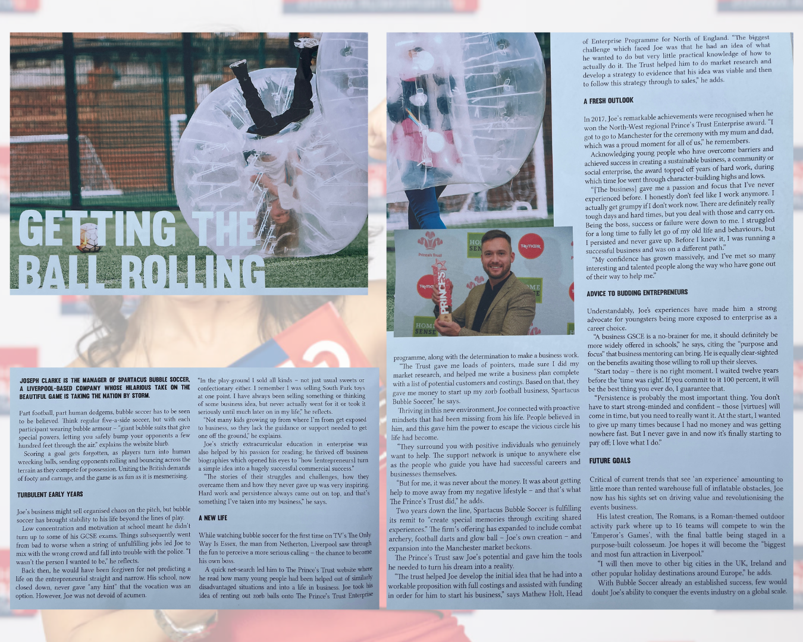
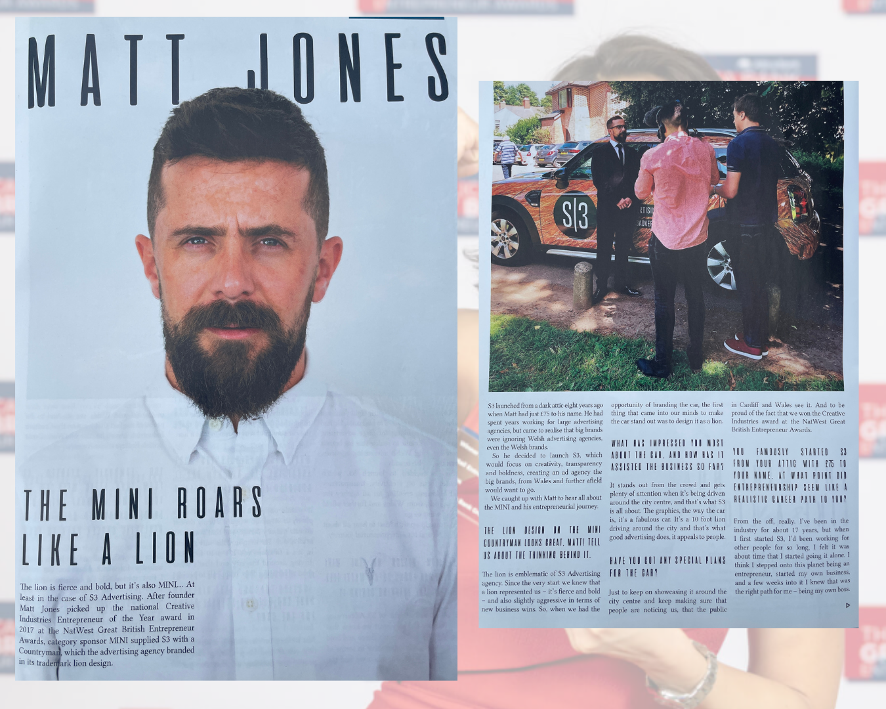
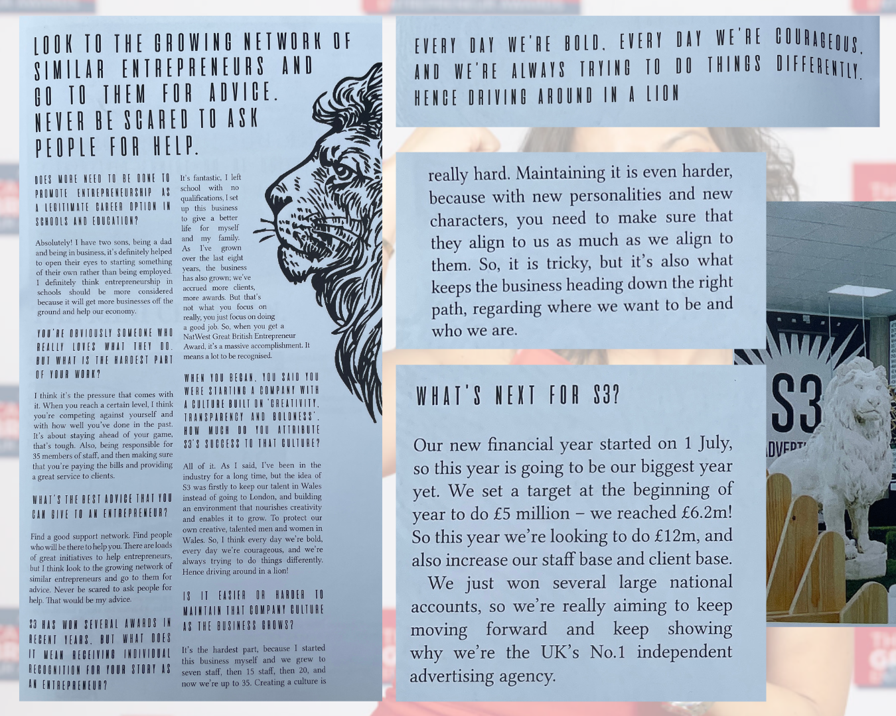
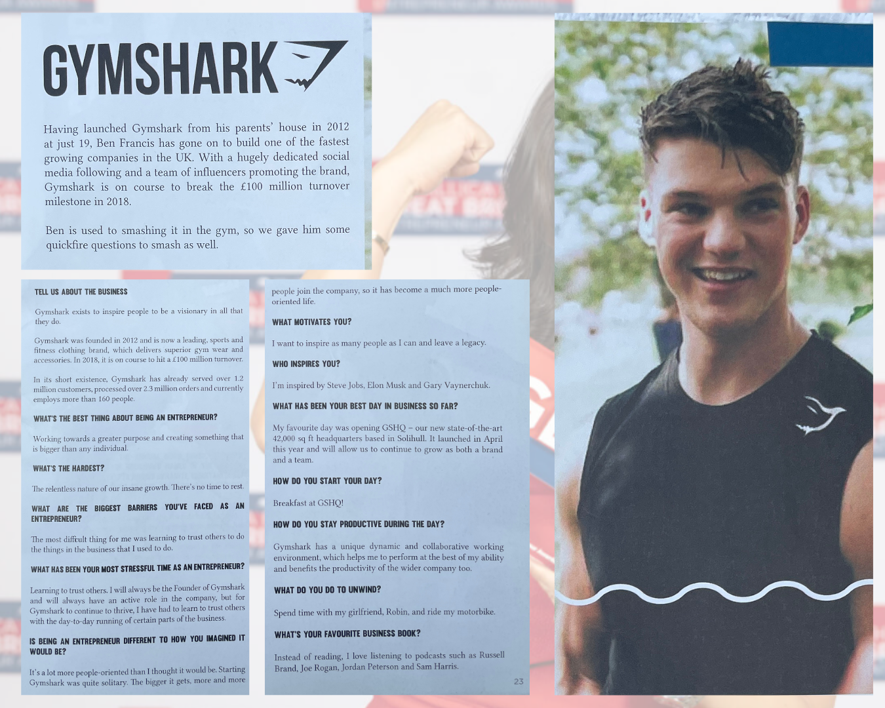
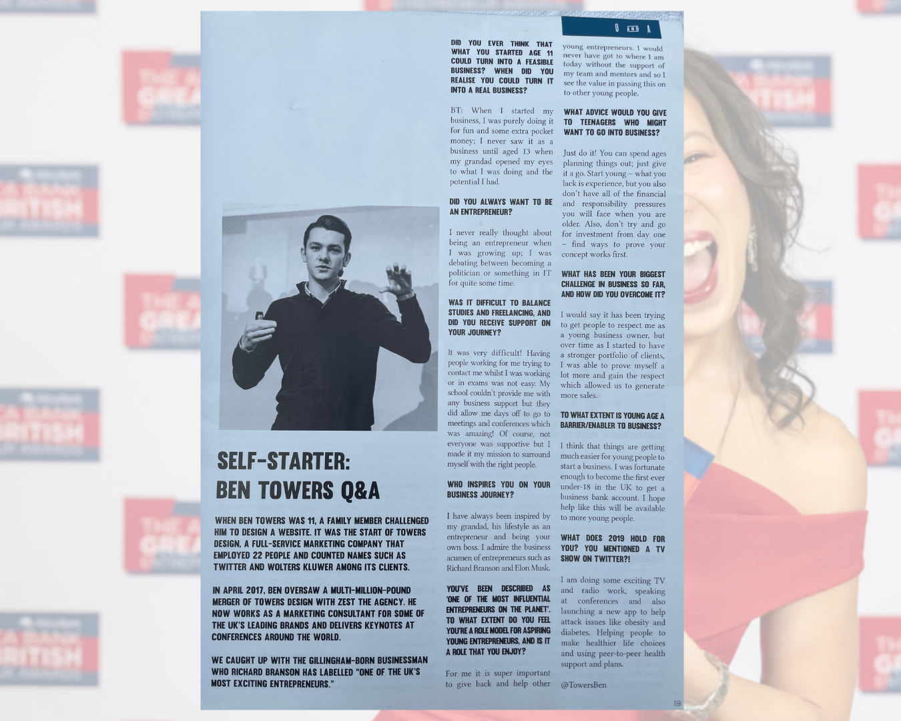
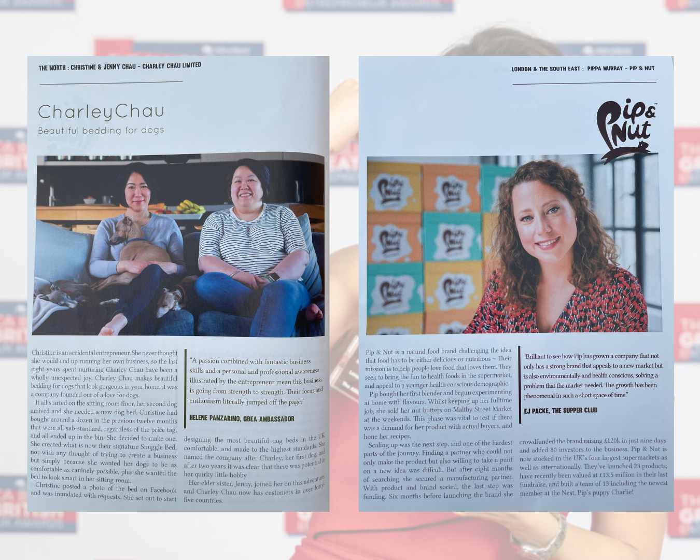

# Entrepreneurship Journalism
### NB: ALL CONTENT WRITTEN PRE-AI

Entrepreneurship journalism and editorial work produced while Head of Content at [The Great British Entrepreneur Awards](https://greatbritishentrepreneurawards.com/), including interviews, profiles and feature reporting on founders, SMEs, and business leaders across the UK. 

During my time working with the Great British Entrepreneur Awards, I was also **co-writer and co-editor of *Entrepreneurs GB* Magazine**. The publication featured interviews, profiles and feature reporting on leading UK entrepreneurs, startup founders and emerging businesses.

## *Entrepreneurs GB* Magazines – Spring 2018 & 2019

## Entrepreneur Profiles, Q&A

Profiles I wrote for *Entrepreneurs GB Magazine* exploring the experiences and perspectives of major UK entrepreneurs and business leaders, including Go.Compare founder Hayley Parsons OBE, MOBO Awards CEO Kanya King CBE, and "The Phonebox Millionnaire" Stephen Fear.

### Hayley Parsons OBE
Hayley Parsons, Welsh entrepreneur and founder of the price comparison website Go.Compare.

### Kanya King CBE
Kanya King, founder of the MOBO Awards and one of the most influential figures in championing Black music in the UK.

### Stephen Fear
Bristol-born entrepreneur property magnate, Stephen Fear, founder of The Fear Group and known as _The Phonebox Millionnaire_.

## Entrepreneur Features

A selection of features I wrote for *Entrepreneurs GB Magazine*, highlighting emerging companies, founder stories and the wider UK startup ecosystem.

This section highlights the stories of Bristolian, Ben Clifford, Birmingham-born Angus Drummond, and Liverpool's Joseph Clarke, each of whom have overcome considerable personal challenges to succeed in business.

### Joseph Clarke
Joseph Clarke, Liverpool-born entrepreneur and founder of Spartacus Bubble Soccer.

## Tech Reporting

### Amplyfi: The First Unicorn in the Land of Dragons?

A feature exploring the growth of Cardiff-based technology company AMPLYFI and the rise of the Welsh startup ecosystem.

## Entrepreneur Q&A

A series of my Q&A interviews with emerging UK entrepreneurs exploring new ventures and the future of British business.

### Matt Jones
Q&A with Welsh advertising entrepreneur, Matt Jones.

### Ben Francis: Gymshark
Benjamin David Francis MBE is a British billionaire businessman. He is the co-founder, CEO and majority owner of Gymshark, a fitness apparel and accessories company founded in 2012.

### Ben Towers MBE
Ben Towers, entrepreneur and founder of the digital marketing agency, Zest.

## Short-Form Editorial and Copywriting

Examples of my short-form editorial writing and caption copy produced for *Entrepreneurs GB Magazine*. The work includes entrepreneur mini-profiles, product features and curated list content written to accompany editorial photography and award coverage.

