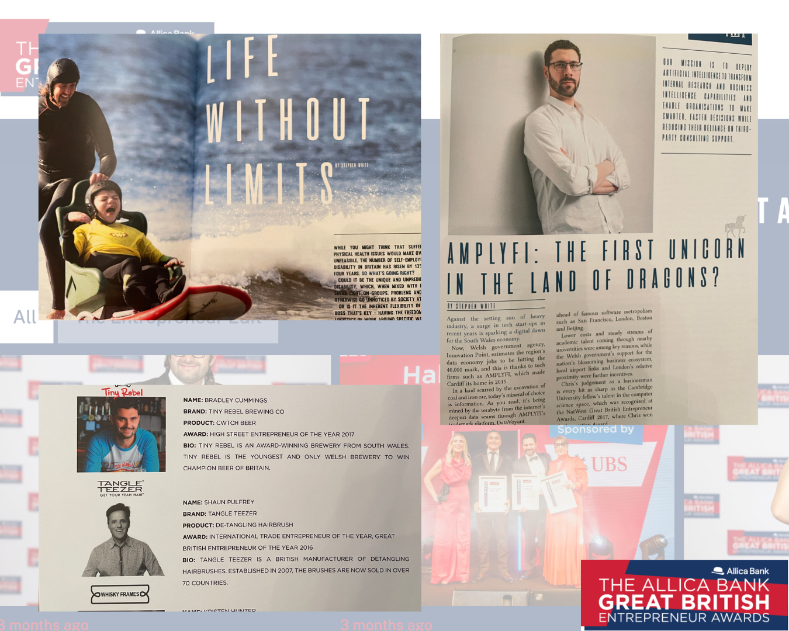

# Entrepreneurship_Journalism
A portfolio of entrepreneurship journalism and editorial work produced for the Great British Entrepreneur Awards, including interviews, profiles and feature reporting on founders, SMEs, and business leaders across the UK.

During my time working with the Great British Entrepreneur Awards, I served as **co-writer and co-editor of *Entrepreneurs GB Magazine***.

The publication featured interviews, profiles and feature reporting on leading UK entrepreneurs, startup founders and emerging businesses.

## Entrepreneurs GB Magazine – Spring 2018

## Entrepreneur Profiles, Q&A

Interview features from *Entrepreneurs GB Magazine* exploring the experiences and perspectives of UK entrepreneurs and business leaders.

Profiles include entrepreneur and investor Stephen Fear, rising founder Kieran Aitken, and leadership expert Brian Chernett.

## Features and Editorial Profiles

A selection of feature reporting and editorial profiles from *Entrepreneurs GB Magazine*, highlighting emerging companies, founder stories and the wider UK startup ecosystem.

This section includes a profile of entrepreneur Ben Clifford, a feature exploring Cardiff-based technology company AMPLIFI and the growth of the Welsh startup scene, alongside examples of short-form editorial copy produced for the magazine.

